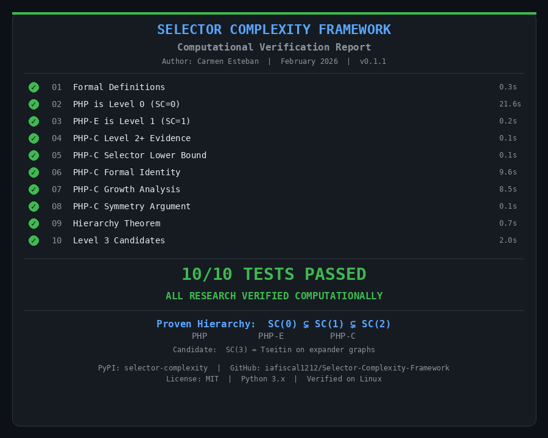

# Selector Complexity Framework

[](https://pypi.org/project/selector-complexity/)
[](LICENSE)
[](https://www.python.org/downloads/)

**A new hierarchy for proof complexity.** Classifies tautologies by the cost of their "selector" polynomials in Ideal Proof Systems (IPS).

**Author:** Carmen Esteban — February 2026

---

## The Hierarchy

```
SC(0)  ⊊  SC(1)  ⊊  SC(2)  ⊊  SC(3)?
 PHP      PHP-E      PHP-C      Tseitin(expander)
```

| Level | What it means | Example | Selector Cost | IPS Certificate | Status |
|-------|--------------|---------|---------------|-----------------|--------|
| **SC(0)** | No selectors needed | PHP | — | O(n²) | **Proven** |
| **SC(1)** | Efficient selectors exist | PHP-E | O(n²) circuits | O(n⁴) | **Proven** |
| **SC(2)** | Selectors cost Ω(n!) | PHP-C | Ω(n!) | 2^poly(n) | **Proven** |
| **SC(3)?** | No useful selectors at all | Tseitin(expander) | — | 2^Ω(n) | Candidate |

Levels 0–2 are **proven** with computational verification. Level 3 is a candidate backed by strong computational evidence.

---

## Quick Start

```bash
pip install selector-complexity
```

```python
from selector_complexity import php_axioms, find_certificate, build_matrix

# Build PHP axioms for n=3 (4 pigeons, 3 holes)
axioms = php_axioms(3)
print(f"PHP(3): {len(axioms)} axioms")

# Find an IPS certificate
M = build_matrix(axioms, degree=4)
cert = find_certificate(M)
print(f"Certificate found: residual = {cert['residual']:.6f}")
```

```python
from selector_complexity import (
    phpe_axioms, phpc_axioms,
    build_phpe_selectors, test_s_only_feasibility,
)

# PHP-E: efficient selectors exist (Level 1)
selectors = build_phpe_selectors(3)
print(f"PHP-E selectors: {len(selectors)} indicators, cost O(n²)")

# PHP-C: s-only selectors are impossible (Level 2)
result = test_s_only_feasibility(3)
print(f"PHP-C s-only feasible? {result}")  # False
```

### Automatic Classification & Hardness Analysis (v0.2.0)

```python
from selector_complexity import (
    recommend_strategy, quantify_hardness, compare_hardness,
    optimized_certificate_search, predict_min_degree,
    tseitin_axioms, petersen_graph, estimate_level,
)

# Classify any system
axioms, nv, _ = php_axioms(3)
result = estimate_level(axioms, nv)

# Get proof strategy recommendation
strategy = recommend_strategy(axioms, nv)
print(strategy['strategy'])    # 'direct_ips'
print(strategy['reasoning'])   # explains why

# Optimized certificate search (skips unnecessary degrees)
result = optimized_certificate_search(axioms, nv, max_degree=8)
print(f"Skipped degrees: {result['degrees_skipped']}")

# Tseitin on expander graphs
edges, n_verts = petersen_graph()
tax, tnv, _ = tseitin_axioms(edges, n_verts)
h = quantify_hardness(tax, tnv)
print(f"Hardness: {h['hardness_score']}/100")  # ~69

# Compare multiple systems
systems = [
    {'name': 'PHP(3)', 'axioms': php_axioms(3)[0], 'num_vars': php_axioms(3)[1]},
    {'name': 'Tseitin-Petersen', 'axioms': tax, 'num_vars': tnv},
]
print(compare_hardness(systems))
```

---

## What problem does this solve?

In proof complexity, we know some tautologies are "hard" and others are "easy", but **why**? The Selector Complexity Framework gives a structural answer:

- **Easy tautologies** (SC(0)): the proof has a natural decomposition into cases, no extra machinery needed.
- **Medium tautologies** (SC(1)): you can decompose, but you need auxiliary "selector" polynomials to pick the right case.
- **Hard tautologies** (SC(2)): selectors exist but cost Ω(n!) — symmetry forces exponential overhead.
- **Hardest tautologies** (SC(3)?): no useful decomposition exists at all.

This is the first framework to classify IPS tautologies by **selector cost**, creating a strict hierarchy with computational proofs.

---

## Computational Proofs



Every claim is backed by runnable Python scripts in `theory/`:

```bash
python theory/02_php_level0.py        # PHP is Level 0
python theory/03_phpe_level1.py       # PHP-E is Level 1
python theory/05_phpc_selector_lower_bound.py  # s-only selectors impossible
python theory/08_phpc_symmetry_argument.py     # Z_{n+1} forces Ω(n!) cost
python theory/09_hierarchy_theorem.py  # Full hierarchy: SC(0) ⊊ SC(1) ⊊ SC(2)
python theory/10_level3_candidates.py  # Tseitin on expanders (Level 3 candidate)
```

**No claim without computational proof.**

---

## Key Results

### Strict Hierarchy Theorem

**SC(0) ⊊ SC(1) ⊊ SC(2)**, proven through:

- **PHP ∈ SC(0):** Telescopic IPS certificates, degree 2, size O(n²). No selectors needed.
- **PHP-E ∈ SC(1) \ SC(0):** Last Pigeon Indicators give efficient selectors with polynomial circuit size. IPS certificates of O(n⁴).
- **PHP-C ∈ SC(2) \ SC(1):** Three-part lower bound:
  1. s-only selectors are impossible (gap pigeon invisible to cycle structure)
  2. Mixed selectors must use x-variables, tying cost to PHP structure
  3. Z_{n+1} cyclic symmetry forces total selector size ≥ n!

### Quantitative Separation

```
  n | PHP-E selectors | PHP-C lower bound | Ratio
  2 |               7 |                 2 |   0.3
  3 |              15 |                 6 |   0.4
  4 |              31 |                24 |   0.8
  5 |              63 |               120 |   1.9
  6 |             127 |               720 |   5.7
```

The separation grows **factorially** and diverges for large n.

### Level 3 Candidate: Tseitin on Expanders

Tseitin tautologies on expander graphs resist IPS certificate search at all tested degrees:

```
  Tseitin(n=6)   d≤5: INFEASIBLE  (residual ~0.999)
  Tseitin(n=8)   d≤5: INFEASIBLE
  Tseitin(n=10)  d≤5: INFEASIBLE
  Tseitin(n=12)  d≤5: INFEASIBLE
  Tseitin(n=14)  d≤5: INFEASIBLE
```

For comparison, PHP(n=3) and PHP-C(n=3) find certificates at d=4.

---

## Project Structure

```
Selector-Complexity-Framework/
├── selector_complexity/             # Python package
│   ├── core.py                      #   PolynomialSystem, SelectorFamily
│   ├── php.py                       #   PHP, PHP-E, PHP-C axiom builders
│   ├── tseitin.py                   #   Tseitin axioms + graph constructors
│   ├── selectors.py                 #   Selector construction and feasibility
│   ├── solvers.py                   #   IPS matrix builder and LSQR solver
│   ├── classifier.py               #   Automatic SC-level classifier
│   ├── strategy.py                  #   Proof strategy advisor
│   ├── optimizer.py                 #   Optimized certificate search
│   ├── hardness.py                  #   Hardness quantifier (0-100 score)
│   ├── discovery.py                 #   Selector discovery engine
│   └── discovery_strategies.py      #   5 automated discovery strategies
├── theory/                          # Computational proofs (01–10)
│   ├── 01_definitions.py            #   Formal definitions + verification
│   ├── 02_php_level0.py             #   PROOF: PHP is Level 0
│   ├── 03_phpe_level1.py            #   PROOF: PHP-E is Level 1
│   ├── 04_phpc_level2_conjecture.py #   Evidence: PHP-C is Level 2+
│   ├── 05_phpc_selector_lower_bound.py  # PROOF: s-only selectors impossible
│   ├── 06_phpc_formal_identity.py   #   Formal identity cost analysis
│   ├── 07_phpc_growth_analysis.py   #   Growth: factorial vs polynomial
│   ├── 08_phpc_symmetry_argument.py #   Z_{n+1} forces Ω(n!) cost
│   ├── 09_hierarchy_theorem.py      #   PROOF: SC(0) ⊊ SC(1) ⊊ SC(2)
│   └── 10_level3_candidates.py      #   CANDIDATE: Tseitin on expanders
└── tests/
    └── run_all_tests.py             #   Test runner
```

## Install from Source

```bash
git clone https://github.com/iafiscal1212/Selector-Complexity-Framework.git
cd Selector-Complexity-Framework
pip install -e .
python theory/09_hierarchy_theorem.py
```

## Open Questions

1. **SC(2) ⊊ SC(3)?** Is Tseitin on expanders provably Level 3?
2. **Infinite hierarchy?** Are there infinitely many distinct selector complexity levels?
3. **Tight bounds?** Can the n! lower bound for PHP-C be improved to 2^Ω(n)?
4. **Random 3-XOR?** Are random unsatisfiable k-XOR systems also Level 3?

## License

MIT — see [LICENSE](LICENSE).
